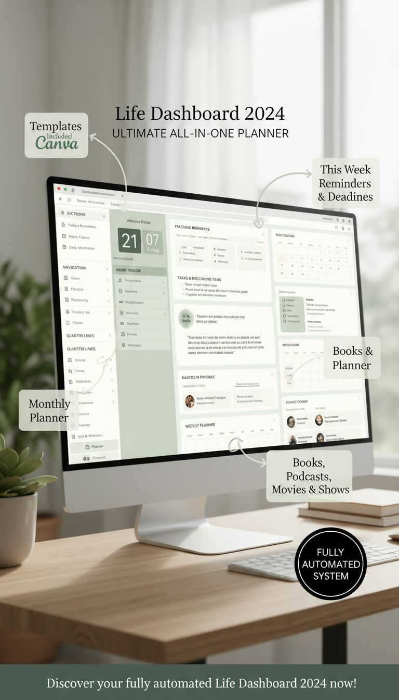
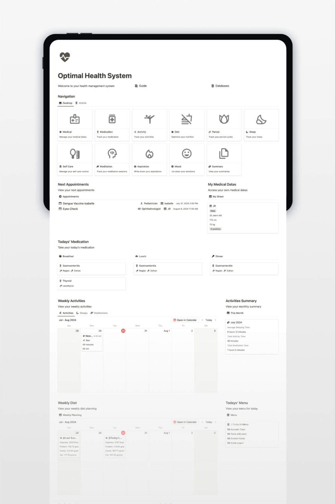
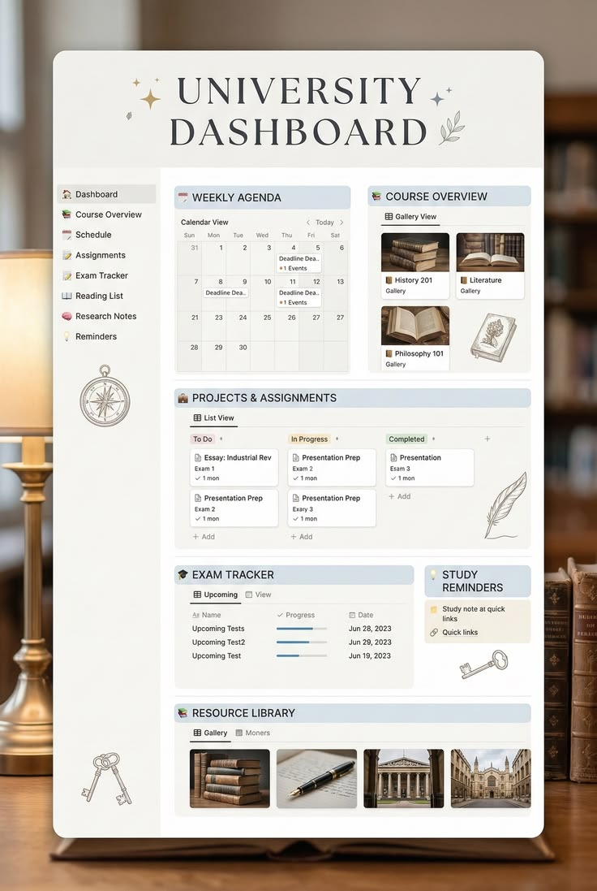

# RuahNote 디자인 기획서

## 1. 디자인 목표

RuahNote의 디자인은 단순한 업무 관리 프로그램처럼 차갑게 보이기보다, 사용자가 매일 공부하고 기록하고 정리하고 싶어지는 **조용한 학습 공간**처럼 느껴져야 한다.

첨부된 참고 이미지는 공통적으로 다음 분위기를 갖는다.

- 노션 기반 대시보드 느낌
- 따뜻한 실내 배경
- 큰 제목과 정돈된 카드형 UI
- 부드러운 아이보리/세이지/그레이톤
- 학습, 건강, 대학 생활, 플래너 중심의 정보 구조
- 과도한 색상보다 여백과 정렬 중심

RuahNote는 이 스타일을 바탕으로 **대학원·대학생·직장인이 모두 사용할 수 있는 프리미엄 기록 대시보드**를 지향한다.

---

## 2. 첨부 이미지 분석

## 2.1 참고 이미지 1: Life Dashboard 스타일



### 주요 특징

- 세로형 홍보 이미지 구성
- 책상 위 모니터에 대시보드 화면 배치
- 부드러운 자연광
- 세이지 그린과 크림톤 중심
- serif 계열 제목으로 고급스러운 인상
- 화면 곳곳에 콜아웃 박스 배치
- `Monthly Planner`, `This Week Reminders & Deadlines`, `Books & Planner` 등 기능 포인트를 외부 라벨로 설명

### RuahNote 적용 포인트

- 랜딩 페이지 또는 소개 화면에 적합
- 기능을 설명하는 콜아웃 디자인에 활용 가능
- `강의노트`, `이번 주 과제`, `스캔 자료`, `구글 캘린더`, `메일`을 시각적으로 연결하는 홍보 이미지에 적합
- 메인 컬러는 세이지 그린 계열을 사용할 수 있음

---

## 2.2 참고 이미지 2: Optimal Health System 스타일



### 주요 특징

- 태블릿 화면 안에 시스템 전체 구조가 배치됨
- 거의 무채색에 가까운 미니멀 UI
- 큰 아이콘 카드형 메뉴
- 각 섹션이 명확히 분리됨
- 건강 관리 대시보드지만 정보 구조가 매우 체계적임
- 여백이 넓고 복잡하지 않음

### RuahNote 적용 포인트

- RuahNote의 관리형 대시보드 구조에 적합
- 좌측 메뉴와 중앙 카드형 기능 메뉴 구현에 참고
- `노트`, `녹음`, `과제`, `스캔`, `캘린더`, `메일`, `파일함`, `연락처`를 아이콘 카드로 표현 가능
- 사용자가 처음 들어왔을 때 전체 시스템을 한눈에 파악하게 하는 구조로 적합

---

## 2.3 참고 이미지 3: University Dashboard 스타일



### 주요 특징

- 대학 생활 플래너 콘셉트가 가장 강함
- 큰 serif 타이틀 `UNIVERSITY DASHBOARD`
- 좌측 사이드바에 메뉴가 세로로 정리됨
- 중앙에는 Weekly Agenda, Course Overview, Projects & Assignments, Exam Tracker, Resource Library가 카드형으로 배치됨
- 배경은 도서관/책장 분위기
- 아이보리 배경과 연한 블루 섹션 헤더 사용
- 학습 도구라는 정체성이 명확함

### RuahNote 적용 포인트

- RuahNote 메인 대시보드의 핵심 참고안
- 큰 카테고리/과목/노트 구조를 학습형 UI로 표현하기 좋음
- 과제 칸반, 주간 일정, 자료 라이브러리, 시험/발표 추적 기능에 적합
- 대학원 사용자를 1차 타깃으로 할 때 가장 설득력 있는 디자인 방향

---

## 3. 디자인 콘셉트

### 3.1 콘셉트명

**Academic Calm Dashboard**

### 3.2 디자인 키워드

- 차분한
- 정돈된
- 학습적인
- 프리미엄
- 노션형
- 카드형
- 도서관 감성
- 세이지 그린
- 아이보리
- 생산성 대시보드

### 3.3 사용자에게 전달해야 할 느낌

- 복잡한 자료가 정리되고 있다는 느낌
- 공부와 업무를 계속 이어가고 싶게 만드는 느낌
- 강의·회의·자료·과제가 흩어지지 않는다는 안정감
- 노션보다 학습/업무 실행에 특화되어 있다는 인상
- 삼성노트보다 자료 정리와 과제 관리가 강하다는 인상

---

## 4. 전체 UI 방향

### 4.1 레이아웃 기본 구조

RuahNote는 3단 구조를 기본으로 한다.

```text
좌측 사이드바       중앙 작업 영역                 우측 보조 패널
메뉴/카테고리       노트/대시보드/목록              관련 자료/AI/과제
```

### 4.2 좌측 사이드바

좌측 사이드바는 프로그램 전체 메뉴와 큰 카테고리 접근을 담당한다.

구성:

- RuahNote 로고
- 대시보드
- 노트
- 녹음/강의노트
- 과제
- 스캔센터
- 캘린더
- 메일
- 파일함
- 연락처
- 설정

하단에는 현재 연결된 구글 계정과 동기화 상태를 표시한다.

### 4.3 중앙 작업 영역

사용자가 실제로 보는 핵심 화면이다.

화면 종류:

- 대시보드 카드
- 노트 작성 에디터
- 과제 목록
- 캘린더
- 스캔 이미지 목록
- 메일 목록
- 파일함

### 4.4 우측 보조 패널

상황에 따라 표시되는 보조 정보 영역이다.

노트 화면에서는:

- 관련 과제
- 연결 녹음
- 연결 스캔 자료
- OCR 텍스트
- AI 요약
- 태그

과제 화면에서는:

- 관련 노트
- 관련 파일
- 마감 알림
- 제출 링크
- 담당자 연락처

녹음 화면에서는:

- 타임라인 메모
- AI 요약
- 과제 후보
- 핵심 키워드

---

## 5. 정보 구조 디자인

## 5.1 큰 카테고리 화면

### 목적

사용자가 `2026년 1학기`, `회사 프로젝트`, `개인 연구` 같은 큰 단위를 먼저 선택하도록 한다.

### UI 형태

카드형 목록을 기본으로 한다.

카드 예시:

```text
┌────────────────────┐
│ 2026년 1학기        │
│ 과목 5개 · 노트 42개 │
│ 과제 8개 · 진행중 3개│
└────────────────────┘
```

### 표시 정보

- 카테고리명
- 하위 과목/프로젝트 개수
- 전체 노트 수
- 진행 중 과제 수
- 최근 업데이트 날짜
- 대표 색상 또는 아이콘

---

## 5.2 과목/프로젝트 화면

### 목적

큰 카테고리 안에서 과목별 또는 프로젝트별 기록을 관리한다.

### UI 구성

- 상단: 카테고리명과 하위 분류명
- 중앙: 날짜별 노트 타임라인
- 우측: 과제/파일/녹음 요약

### 날짜별 노트 표시 방식

리스트형과 카드형을 모두 제공한다.

리스트형:

```text
2026-03-05  조직신학 1주차  녹음 있음 · 과제 1개 · 이미지 3장
2026-03-12  조직신학 2주차  OCR 있음 · PDF 1개
```

카드형:

```text
┌────────────────────────┐
│ 3월 5일 조직신학 1주차 │
│ 녹음 1 · 이미지 3 · 과제 1 │
└────────────────────────┘
```

---

## 5.3 노트 작성 화면

### 기본 레이아웃

```text
상단 바: 카테고리 > 과목 > 날짜 노트
좌측: 과목 내 노트 목록
중앙: 노트 에디터
우측: 관련 자료 패널
```

### 에디터 상단 버튼

- 이미지 첨부
- 카메라 촬영
- 스캔 불러오기
- 파일 첨부
- 녹음 연결
- OCR 실행
- AI 요약
- 과제 추출

### 노트 본문 디자인

- 배경: 아이보리 또는 화이트
- 본문 폭: 너무 넓지 않게 제한
- 줄간격: 넉넉하게
- 제목은 serif 또는 굵은 sans-serif
- 본문은 가독성 높은 sans-serif
- 이미지와 OCR 텍스트는 카드형 블록으로 구분

---

## 5.4 대시보드 화면

### 디자인 방향

참고 이미지 3의 University Dashboard 구조를 RuahNote에 맞게 확장한다.

### 대시보드 섹션

- Weekly Agenda
- Today Notes
- Projects & Assignments
- Recent Lecture Notes
- Scan Center
- Resource Library
- Mail Inbox
- Calendar Sync

### 카드 배치 예시

```text
┌───────────────────┬───────────────────┐
│ 이번 주 일정        │ 과목/프로젝트 개요  │
├───────────────────┼───────────────────┤
│ 과제 진행 현황      │ 최근 강의노트       │
├───────────────────┼───────────────────┤
│ 스캔/OCR 자료       │ 파일 라이브러리     │
└───────────────────┴───────────────────┘
```

### 주요 카드

#### 이번 주 일정 카드

- 오늘 일정
- 이번 주 수업/회의
- 과제 마감일
- 구글 캘린더 일정

#### 과제 카드

- To Do
- In Progress
- Review
- Completed

#### 최근 강의노트 카드

- 최근 STT 완료 녹음
- 최근 AI 요약
- 과제 후보 있음 표시

#### 스캔센터 카드

- 최근 스캔 폴더
- OCR 미적용 이미지
- PDF 변환 대기 자료

---

## 5.5 과제 관리 화면

### 디자인 방향

칸반 보드와 리스트 보기를 함께 제공한다.

### 칸반 컬럼

- 대기
- 진행 중
- 검토 필요
- 제출 완료
- 완료 보관

### 카드 표시 정보

- 과제명
- 과목명
- 마감일
- 남은 기간
- 중요도
- 관련 노트
- 첨부파일
- 완료 버튼

### 색상 규칙

- 정상: 기본 카드 색상
- 7일 이내: 연한 베이지/옐로우 계열
- 3일 이내: 연한 오렌지 계열
- 기한 초과: 연한 레드 계열
- 완료: 연한 그레이 계열

---

## 5.6 스캔센터 화면

### 디자인 방향

스캔센터는 파일 관리 화면처럼 보이되, 작업 흐름이 분명해야 한다.

### 상단 작업 버튼

- 새 스캔
- OCR 변환
- PDF 변환
- 노트에 첨부
- 과제에 연결

### 스캔 폴더 카드

```text
┌──────────────────────┐
│ 웨슬리설교_참고자료   │
│ 이미지 12장           │
│ OCR 8장 완료          │
│ PDF 1개 생성          │
└──────────────────────┘
```

### 이미지 목록

- 썸네일 그리드
- 파일명
- OCR 여부
- PDF 포함 여부
- 선택 체크박스

### OCR/PDF 진행 표시

- `OCR 대기`
- `OCR 진행 중`
- `OCR 완료`
- `PDF 변환 가능`
- `PDF 생성 완료`

---

## 5.7 캘린더 화면

### 구성

- 월간 보기
- 주간 보기
- 오늘 보기
- 과제 마감일 표시
- 구글 캘린더 일정 표시
- 과목별 색상 필터

### 디자인 방향

강한 색상보다 점, 라벨, 작은 태그를 활용한다.

---

## 5.8 메일 화면

### 구성

- 좌측: 연결 계정 목록
- 중앙: 메일 목록
- 우측: 메일 상세 또는 관련 과제 추출 패널

### 다중 계정 표현

각 계정은 작은 색상 점과 이메일 주소로 구분한다.

예시:

```text
● 학교 계정 user@school.ac.kr
● 개인 계정 user@gmail.com
● 업무 계정 user@company.com
```

---

## 6. 컬러 시스템

### 6.1 메인 컬러

| 역할 | 색상명 | HEX | 용도 |
|---|---|---|---|
| Primary | Sage Green | `#7F927F` | 주요 버튼, 활성 메뉴, 포인트 |
| Background | Warm Ivory | `#F7F4EC` | 전체 배경 |
| Surface | Soft White | `#FFFFFF` | 카드, 노트 본문 |
| Border | Mist Gray | `#DADDD5` | 카드 테두리, 구분선 |
| Text Main | Charcoal | `#2F3430` | 본문 텍스트 |
| Text Sub | Muted Gray | `#767C73` | 보조 텍스트 |
| Accent | Dusty Blue | `#D9E5EA` | 섹션 헤더, 학습 카드 |
| Warning | Soft Amber | `#F3D9A4` | 마감 임박 |
| Danger | Soft Rose | `#E8B8B0` | 기한 초과 |
| Success | Pale Green | `#DCE8D8` | 완료 상태 |

### 6.2 색상 사용 원칙

- 배경은 따뜻한 아이보리 계열
- 카드와 입력 영역은 흰색 중심
- 주요 액션은 세이지 그린
- 학습 섹션 헤더는 연한 블루 또는 그린
- 경고 색상은 강하지 않게 부드럽게 사용
- 메일/캘린더 계정 구분 색상은 작은 점이나 태그로만 사용

---

## 7. 타이포그래피

### 7.1 제목

추천:

- Playfair Display
- Cormorant Garamond
- Noto Serif KR

사용 위치:

- 랜딩 페이지 제목
- 대시보드 대제목
- 카테고리 타이틀

### 7.2 본문/UI 텍스트

추천:

- Pretendard
- Noto Sans KR
- Inter

사용 위치:

- 메뉴
- 본문
- 카드 내용
- 버튼
- 입력 폼

### 7.3 타이포그래피 원칙

- 제목은 여유 있게 크게
- 본문은 가독성을 최우선
- 카드 안의 정보는 2~3단계 위계만 사용
- 작은 글씨를 과도하게 사용하지 않음

---

## 8. 컴포넌트 디자인

## 8.1 카드

### 기본 카드

- 배경: 흰색
- 테두리: 연한 회색
- 라운드: 12px~18px
- 그림자: 매우 약하게
- 내부 여백: 16px~24px

### 카드 종류

- 일정 카드
- 과제 카드
- 노트 카드
- 스캔 폴더 카드
- 파일 카드
- 메일 카드
- AI 요약 카드

---

## 8.2 버튼

### 버튼 유형

- Primary: 주요 실행
- Secondary: 보조 실행
- Ghost: 가벼운 실행
- Danger: 삭제

### 예시

- 새 노트
- OCR 실행
- PDF 변환
- 과제 등록
- 완료 처리
- 메일 보내기

---

## 8.3 상태 배지

### 상태 예시

- OCR 완료
- PDF 완료
- 녹음 연결
- AI 요약 완료
- 과제 후보 있음
- 마감 임박
- 완료

### 디자인

- 작은 라운드 배지
- 배경색은 연하게
- 텍스트는 짧게

---

## 8.4 아이콘

### 스타일

- 선형 아이콘
- 두께는 1.5px~2px
- 과도한 3D 아이콘 지양
- 메뉴별 직관적 아이콘 사용

### 예시

- 노트: 문서 아이콘
- 녹음: 마이크 아이콘
- 과제: 체크리스트 아이콘
- 스캔: 카메라/스캐너 아이콘
- 캘린더: 달력 아이콘
- 메일: 봉투 아이콘
- 연락처: 사용자 아이콘

---

## 9. 반응형 디자인

### 데스크톱

- 3단 레이아웃 기본
- 좌측 사이드바 고정
- 중앙 작업 영역 넓게
- 우측 패널 선택 표시

### 태블릿

- 좌측 사이드바 접기 가능
- 우측 패널은 슬라이드 패널로 표시
- 노트 작성과 카메라 촬영 최적화

### 모바일

- 하단 탭 메뉴 사용
- 카메라 촬영과 빠른 메모 중심
- 대시보드는 카드 세로 배열
- 복잡한 DB 관리는 최소화

---

## 10. 랜딩/소개 화면 방향

### 구성

1. Hero Section
   - `RuahNote`
   - `기록에서 과제까지, 하나의 흐름으로 정리하세요.`
   - 주요 CTA: `시작하기`, `데모 보기`

2. 기능 콜아웃
   - 노트
   - 녹음
   - AI 강의노트
   - 과제
   - 스캔센터
   - 구글 연동

3. 대시보드 미리보기
   - 첨부 이미지 1처럼 화면 위에 콜아웃 라벨 표시

4. 사용 시나리오
   - 대학원 수업
   - 회사 회의
   - 자격증 학습
   - 프로젝트 관리

---

## 11. 최종 디자인 방향 요약

RuahNote의 디자인은 참고 이미지 3의 **University Dashboard**를 기본 구조로 삼고, 참고 이미지 1의 **프리미엄 라이프스타일 홍보 감성**, 참고 이미지 2의 **미니멀 시스템형 카드 UI**를 결합한다.

최종 지향점은 다음이다.

```text
노션의 정리감
+ 삼성노트의 기록성
+ 대학 플래너의 학습 감성
+ 업무 대시보드의 실행 관리
```

RuahNote는 사용자가 매주 수업 또는 회의를 기록하면서 자연스럽게 노트, 녹음, 스캔, 과제, 일정, 메일을 연결할 수 있는 차분하고 정돈된 대시보드형 UI로 설계한다.
