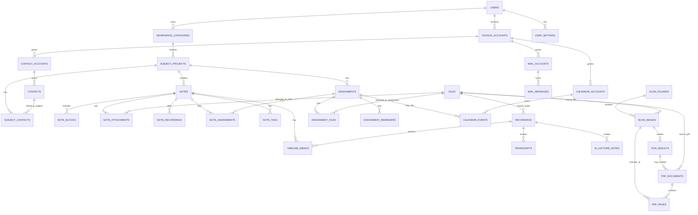

# RuahNote DB 관련 기획서

## 1. DB 설계 목표

RuahNote의 핵심은 데이터 관리이다. 사용자가 생성하는 노트, 녹음, 이미지, OCR 텍스트, PDF, 과제, 일정, 메일, 연락처가 서로 연결되어야 한다.

따라서 DB는 단순한 노트 저장소가 아니라 다음 관계를 안정적으로 표현해야 한다.

```text
사용자
→ 큰 카테고리
→ 과목/프로젝트
→ 날짜별 노트
→ 첨부 자료/녹음/OCR/PDF
→ 과제/일정/메일/연락처
```

---

## 2. 핵심 데이터 계층

## 2.1 큰 구조

```text
User
└─ WorkspaceCategory
   └─ SubjectProject
      └─ Note
         ├─ NoteBlock
         ├─ Attachment
         ├─ Recording
         ├─ ScanImage
         ├─ OcrText
         ├─ PdfDocument
         └─ Assignment
```

## 2.2 예시 구조

```text
사용자: 황성근
└─ 2026년 1학기
   ├─ 조직신학
   │  ├─ 2026-03-05 조직신학 1주차 노트
   │  │  ├─ 녹음파일 1개
   │  │  ├─ 이미지 3개
   │  │  ├─ OCR 텍스트 1개
   │  │  └─ 과제 1개
   │  └─ 2026-03-12 조직신학 2주차 노트
   ├─ 신약개론
   └─ 설교학
```

---

## 3. DB 구성도

## 3.1 Mermaid ERD



---

## 4. 주요 테이블 설계

## 4.1 users

사용자 기본 정보 테이블이다.

| 컬럼 | 타입 | 설명 |
|---|---|---|
| id | uuid | 사용자 ID |
| name | varchar | 사용자 이름 |
| email | varchar | 대표 이메일 |
| profile_image_url | text | 프로필 이미지 |
| created_at | timestamp | 생성일 |
| updated_at | timestamp | 수정일 |
| deleted_at | timestamp | 탈퇴/삭제 처리일 |

---

## 4.2 workspace_categories

큰 카테고리 테이블이다. 예: `2026년 1학기`, `회사 프로젝트`, `개인 연구`.

| 컬럼 | 타입 | 설명 |
|---|---|---|
| id | uuid | 카테고리 ID |
| user_id | uuid | 사용자 ID |
| name | varchar | 카테고리명 |
| description | text | 설명 |
| category_type | varchar | semester, project, study, work, personal |
| start_date | date | 시작일 |
| end_date | date | 종료일 |
| color | varchar | 표시 색상 |
| icon | varchar | 아이콘 |
| sort_order | int | 정렬 순서 |
| is_archived | boolean | 보관 여부 |
| created_at | timestamp | 생성일 |
| updated_at | timestamp | 수정일 |

---

## 4.3 subject_projects

큰 카테고리 하위의 과목 또는 프로젝트 테이블이다.

| 컬럼 | 타입 | 설명 |
|---|---|---|
| id | uuid | 과목/프로젝트 ID |
| category_id | uuid | 상위 카테고리 ID |
| user_id | uuid | 사용자 ID |
| name | varchar | 과목명/프로젝트명 |
| description | text | 설명 |
| type | varchar | subject, project, meeting_group, study_group |
| professor_or_owner | varchar | 교수명 또는 담당자 |
| default_day | varchar | 기본 요일 |
| default_time | varchar | 기본 시간 |
| location | varchar | 강의실/장소 |
| color | varchar | 표시 색상 |
| icon | varchar | 아이콘 |
| sort_order | int | 정렬 순서 |
| is_archived | boolean | 보관 여부 |
| created_at | timestamp | 생성일 |
| updated_at | timestamp | 수정일 |

---

## 4.4 notes

날짜별 노트의 핵심 테이블이다.

| 컬럼 | 타입 | 설명 |
|---|---|---|
| id | uuid | 노트 ID |
| user_id | uuid | 사용자 ID |
| category_id | uuid | 큰 카테고리 ID |
| subject_project_id | uuid | 과목/프로젝트 ID |
| title | varchar | 노트 제목 |
| note_date | date | 수업/회의 날짜 |
| week_no | int | 주차 |
| note_type | varchar | class, meeting, seminar, reading, general |
| summary | text | 노트 요약 |
| ai_summary | text | AI 요약 |
| content_plain | text | 검색용 일반 텍스트 |
| content_json | jsonb | 에디터 원본 구조 |
| status | varchar | draft, active, archived |
| is_favorite | boolean | 즐겨찾기 |
| created_at | timestamp | 생성일 |
| updated_at | timestamp | 수정일 |
| deleted_at | timestamp | 삭제일 |

### 노트 제목 자동 생성 규칙

```text
{날짜} {과목명} {주차}주차
```

예시:

```text
2026-03-05 조직신학 1주차
```

---

## 4.5 note_blocks

노트 본문 안의 블록 단위 데이터를 저장한다.

| 컬럼 | 타입 | 설명 |
|---|---|---|
| id | uuid | 블록 ID |
| note_id | uuid | 노트 ID |
| block_type | varchar | paragraph, heading, checklist, image, file, ocr, quote |
| content | text | 텍스트 내용 |
| content_json | jsonb | 블록 상세 구조 |
| sort_order | int | 노트 내 순서 |
| source_type | varchar | manual, ocr, transcript, ai |
| source_id | uuid | 원본 데이터 ID |
| created_at | timestamp | 생성일 |
| updated_at | timestamp | 수정일 |

---

## 4.6 files

프로그램 전체 파일 메타데이터 테이블이다.

| 컬럼 | 타입 | 설명 |
|---|---|---|
| id | uuid | 파일 ID |
| user_id | uuid | 사용자 ID |
| original_name | varchar | 원본 파일명 |
| stored_name | varchar | 저장 파일명 |
| file_path | text | 저장 경로 |
| file_url | text | 접근 URL |
| mime_type | varchar | 파일 타입 |
| file_ext | varchar | 확장자 |
| size_bytes | bigint | 파일 크기 |
| width | int | 이미지 가로 크기 |
| height | int | 이미지 세로 크기 |
| duration_seconds | int | 오디오/비디오 길이 |
| file_category | varchar | image, audio, pdf, document, ocr_text |
| checksum | varchar | 중복 감지용 해시 |
| created_at | timestamp | 생성일 |

---

## 4.7 note_attachments

노트와 파일 연결 테이블이다.

| 컬럼 | 타입 | 설명 |
|---|---|---|
| id | uuid | 연결 ID |
| note_id | uuid | 노트 ID |
| file_id | uuid | 파일 ID |
| attachment_type | varchar | image, camera, scan, pdf, document, audio |
| caption | text | 설명 |
| sort_order | int | 정렬 순서 |
| created_at | timestamp | 생성일 |

---

## 4.8 recordings

녹음파일 테이블이다.

| 컬럼 | 타입 | 설명 |
|---|---|---|
| id | uuid | 녹음 ID |
| user_id | uuid | 사용자 ID |
| category_id | uuid | 카테고리 ID |
| subject_project_id | uuid | 과목/프로젝트 ID |
| note_id | uuid | 연결 노트 ID |
| file_id | uuid | 오디오 파일 ID |
| title | varchar | 녹음 제목 |
| recorded_at | timestamp | 녹음일 |
| duration_seconds | int | 길이 |
| status | varchar | uploaded, transcribing, completed, failed |
| created_at | timestamp | 생성일 |
| updated_at | timestamp | 수정일 |

---

## 4.9 transcripts

음성 텍스트 변환 결과 테이블이다.

| 컬럼 | 타입 | 설명 |
|---|---|---|
| id | uuid | 변환 ID |
| recording_id | uuid | 녹음 ID |
| user_id | uuid | 사용자 ID |
| transcript_text | text | 전체 변환 텍스트 |
| transcript_json | jsonb | 시간 정보 포함 변환 결과 |
| language | varchar | 언어 |
| status | varchar | pending, completed, failed |
| created_at | timestamp | 생성일 |

### transcript_json 예시

```json
[
  {
    "start": 12.5,
    "end": 18.2,
    "text": "오늘 수업의 핵심은 웨슬리의 은총론입니다."
  }
]
```

---

## 4.10 ai_lecture_notes

AI 강의노트 결과 테이블이다.

| 컬럼 | 타입 | 설명 |
|---|---|---|
| id | uuid | AI 노트 ID |
| recording_id | uuid | 녹음 ID |
| note_id | uuid | 연결 노트 ID |
| user_id | uuid | 사용자 ID |
| title | varchar | 제목 |
| summary | text | 전체 요약 |
| detail_note | text | 상세 강의노트 |
| key_points | jsonb | 핵심 포인트 |
| keywords | jsonb | 키워드 |
| assignment_candidates | jsonb | 과제 후보 |
| exam_hints | jsonb | 시험 관련 내용 |
| status | varchar | pending, completed, failed |
| created_at | timestamp | 생성일 |

---

## 4.11 timeline_memos

녹음 타임라인과 연결된 메모 테이블이다.

| 컬럼 | 타입 | 설명 |
|---|---|---|
| id | uuid | 타임라인 메모 ID |
| note_id | uuid | 노트 ID |
| recording_id | uuid | 녹음 ID |
| user_id | uuid | 사용자 ID |
| timestamp_seconds | int | 녹음 기준 시간 |
| memo_text | text | 메모 내용 |
| attachment_file_id | uuid | 관련 이미지/파일 |
| created_at | timestamp | 생성일 |

---

## 4.12 assignments

과제 관리 테이블이다.

| 컬럼 | 타입 | 설명 |
|---|---|---|
| id | uuid | 과제 ID |
| user_id | uuid | 사용자 ID |
| category_id | uuid | 큰 카테고리 ID |
| subject_project_id | uuid | 과목/프로젝트 ID |
| title | varchar | 과제명 |
| description | text | 설명 |
| due_date | date | 마감일 |
| due_time | time | 마감 시간 |
| submit_method | varchar | 제출 방식 |
| submit_url | text | 제출 링크 |
| status | varchar | waiting, in_progress, review, submitted, completed, overdue |
| priority | varchar | low, normal, high |
| source_type | varchar | manual, note, transcript, ocr, mail, file |
| source_id | uuid | 원본 ID |
| completed_at | timestamp | 완료일 |
| archived_at | timestamp | 보관일 |
| created_at | timestamp | 생성일 |
| updated_at | timestamp | 수정일 |

---

## 4.13 note_assignments

노트와 과제의 다대다 연결 테이블이다.

| 컬럼 | 타입 | 설명 |
|---|---|---|
| id | uuid | 연결 ID |
| note_id | uuid | 노트 ID |
| assignment_id | uuid | 과제 ID |
| relation_type | varchar | source, reference, result |
| created_at | timestamp | 생성일 |

---

## 4.14 assignment_reminders

과제 알림 테이블이다.

| 컬럼 | 타입 | 설명 |
|---|---|---|
| id | uuid | 알림 ID |
| assignment_id | uuid | 과제 ID |
| user_id | uuid | 사용자 ID |
| remind_at | timestamp | 알림 시각 |
| reminder_type | varchar | app, email, browser, calendar |
| status | varchar | pending, sent, dismissed |
| created_at | timestamp | 생성일 |

---

## 4.15 assignment_files

과제 첨부파일 테이블이다.

| 컬럼 | 타입 | 설명 |
|---|---|---|
| id | uuid | 연결 ID |
| assignment_id | uuid | 과제 ID |
| file_id | uuid | 파일 ID |
| file_role | varchar | reference, draft, final_submit, guide |
| created_at | timestamp | 생성일 |

---

## 4.16 scan_folders

스캔 폴더 테이블이다.

| 컬럼 | 타입 | 설명 |
|---|---|---|
| id | uuid | 스캔 폴더 ID |
| user_id | uuid | 사용자 ID |
| category_id | uuid | 연결 카테고리 ID |
| subject_project_id | uuid | 연결 과목/프로젝트 ID |
| note_id | uuid | 연결 노트 ID |
| assignment_id | uuid | 연결 과제 ID |
| name | varchar | 스캔 폴더명 |
| description | text | 설명 |
| image_count | int | 이미지 수 |
| ocr_status | varchar | none, partial, completed |
| pdf_status | varchar | none, created |
| created_at | timestamp | 생성일 |
| updated_at | timestamp | 수정일 |

---

## 4.17 scan_images

스캔 이미지 테이블이다.

| 컬럼 | 타입 | 설명 |
|---|---|---|
| id | uuid | 스캔 이미지 ID |
| scan_folder_id | uuid | 스캔 폴더 ID |
| file_id | uuid | 이미지 파일 ID |
| user_id | uuid | 사용자 ID |
| page_no | int | 페이지 번호 |
| generated_filename | varchar | 자동 생성 파일명 |
| ocr_status | varchar | pending, completed, failed |
| created_at | timestamp | 생성일 |

### 파일명 규칙

```text
{스캔폴더명}_{page_no 3자리}.jpg
```

예시:

```text
웨슬리설교_참고자료_001.jpg
```

---

## 4.18 ocr_results

OCR 결과 테이블이다.

| 컬럼 | 타입 | 설명 |
|---|---|---|
| id | uuid | OCR 결과 ID |
| user_id | uuid | 사용자 ID |
| source_type | varchar | note_image, scan_image, pdf_page |
| source_id | uuid | 원본 ID |
| extracted_text | text | 추출 텍스트 |
| language | varchar | 인식 언어 |
| confidence | numeric | 인식 신뢰도 |
| status | varchar | pending, completed, failed |
| created_at | timestamp | 생성일 |

---

## 4.19 pdf_documents

PDF 문서 테이블이다.

| 컬럼 | 타입 | 설명 |
|---|---|---|
| id | uuid | PDF ID |
| user_id | uuid | 사용자 ID |
| scan_folder_id | uuid | 스캔 폴더 ID |
| file_id | uuid | PDF 파일 ID |
| title | varchar | PDF 제목 |
| pdf_type | varchar | image_only, ocr_embedded |
| page_count | int | 페이지 수 |
| created_from_ocr | boolean | OCR 적용 여부 |
| created_at | timestamp | 생성일 |

---

## 4.20 pdf_pages

PDF에 포함된 페이지 테이블이다.

| 컬럼 | 타입 | 설명 |
|---|---|---|
| id | uuid | PDF 페이지 ID |
| pdf_document_id | uuid | PDF ID |
| scan_image_id | uuid | 원본 스캔 이미지 ID |
| page_no | int | PDF 내 페이지 번호 |
| ocr_result_id | uuid | 연결 OCR 결과 ID |
| created_at | timestamp | 생성일 |

---

## 4.21 google_accounts

구글 OAuth 계정 테이블이다.

| 컬럼 | 타입 | 설명 |
|---|---|---|
| id | uuid | 구글 계정 연결 ID |
| user_id | uuid | 사용자 ID |
| google_email | varchar | 구글 이메일 |
| display_name | varchar | 표시 이름 |
| access_token_encrypted | text | 암호화된 액세스 토큰 |
| refresh_token_encrypted | text | 암호화된 리프레시 토큰 |
| scopes | jsonb | 권한 범위 |
| token_expires_at | timestamp | 토큰 만료 시각 |
| created_at | timestamp | 생성일 |
| updated_at | timestamp | 수정일 |

---

## 4.22 mail_accounts

Gmail 계정별 관리 테이블이다.

| 컬럼 | 타입 | 설명 |
|---|---|---|
| id | uuid | 메일 계정 ID |
| google_account_id | uuid | 구글 계정 ID |
| user_id | uuid | 사용자 ID |
| email | varchar | 메일 주소 |
| label | varchar | 학교/개인/업무 등 표시명 |
| is_active | boolean | 활성 여부 |
| last_synced_at | timestamp | 마지막 동기화 |

---

## 4.23 mail_messages

동기화된 메일 메타데이터 테이블이다.

| 컬럼 | 타입 | 설명 |
|---|---|---|
| id | uuid | 내부 메일 ID |
| mail_account_id | uuid | 메일 계정 ID |
| user_id | uuid | 사용자 ID |
| gmail_message_id | varchar | Gmail 메시지 ID |
| thread_id | varchar | Gmail 스레드 ID |
| from_email | varchar | 발신자 |
| to_emails | jsonb | 수신자 목록 |
| subject | text | 제목 |
| snippet | text | 미리보기 |
| received_at | timestamp | 수신일 |
| has_attachment | boolean | 첨부 여부 |
| assignment_candidate_status | varchar | none, candidate, registered |
| created_at | timestamp | 생성일 |

---

## 4.24 calendar_accounts

구글 캘린더 계정 테이블이다.

| 컬럼 | 타입 | 설명 |
|---|---|---|
| id | uuid | 캘린더 계정 ID |
| google_account_id | uuid | 구글 계정 ID |
| user_id | uuid | 사용자 ID |
| calendar_email | varchar | 캘린더 계정 이메일 |
| is_active | boolean | 활성 여부 |
| last_synced_at | timestamp | 마지막 동기화 |

---

## 4.25 calendar_events

캘린더 일정 테이블이다.

| 컬럼 | 타입 | 설명 |
|---|---|---|
| id | uuid | 일정 ID |
| calendar_account_id | uuid | 캘린더 계정 ID |
| user_id | uuid | 사용자 ID |
| google_event_id | varchar | 구글 이벤트 ID |
| assignment_id | uuid | 연결 과제 ID |
| title | varchar | 일정명 |
| description | text | 설명 |
| start_time | timestamp | 시작 시각 |
| end_time | timestamp | 종료 시각 |
| location | varchar | 장소 |
| event_type | varchar | google, assignment_due, class, meeting |
| created_at | timestamp | 생성일 |

---

## 4.26 contact_accounts

연락처 계정 테이블이다.

| 컬럼 | 타입 | 설명 |
|---|---|---|
| id | uuid | 연락처 계정 ID |
| google_account_id | uuid | 구글 계정 ID |
| user_id | uuid | 사용자 ID |
| email | varchar | 계정 이메일 |
| last_synced_at | timestamp | 마지막 동기화 |

---

## 4.27 contacts

구글 연락처 테이블이다.

| 컬럼 | 타입 | 설명 |
|---|---|---|
| id | uuid | 연락처 ID |
| contact_account_id | uuid | 연락처 계정 ID |
| user_id | uuid | 사용자 ID |
| google_contact_id | varchar | 구글 연락처 ID |
| name | varchar | 이름 |
| email | varchar | 이메일 |
| phone | varchar | 전화번호 |
| organization | varchar | 소속 |
| memo | text | 메모 |
| created_at | timestamp | 생성일 |

---

## 4.28 subject_contacts

과목/프로젝트와 연락처 연결 테이블이다.

| 컬럼 | 타입 | 설명 |
|---|---|---|
| id | uuid | 연결 ID |
| subject_project_id | uuid | 과목/프로젝트 ID |
| contact_id | uuid | 연락처 ID |
| role | varchar | professor, assistant, teammate, manager |
| created_at | timestamp | 생성일 |

---

## 4.29 tags / note_tags

태그 테이블과 노트-태그 연결 테이블이다.

### tags

| 컬럼 | 타입 | 설명 |
|---|---|---|
| id | uuid | 태그 ID |
| user_id | uuid | 사용자 ID |
| name | varchar | 태그명 |
| color | varchar | 색상 |
| created_at | timestamp | 생성일 |

### note_tags

| 컬럼 | 타입 | 설명 |
|---|---|---|
| id | uuid | 연결 ID |
| note_id | uuid | 노트 ID |
| tag_id | uuid | 태그 ID |
| created_at | timestamp | 생성일 |

---

## 4.30 user_settings

사용자 설정 테이블이다.

| 컬럼 | 타입 | 설명 |
|---|---|---|
| id | uuid | 설정 ID |
| user_id | uuid | 사용자 ID |
| default_image_quality | varchar | low, medium, high |
| camera_quality | varchar | low, medium |
| ocr_auto_ask | boolean | 이미지 첨부 시 OCR 여부 묻기 |
| ocr_auto_run | boolean | OCR 자동 실행 여부 |
| default_reminders | jsonb | 기본 과제 알림 설정 |
| theme | varchar | light, dark, system |
| created_at | timestamp | 생성일 |
| updated_at | timestamp | 수정일 |

---

## 5. 핵심 관계 설명

## 5.1 카테고리와 노트 관계

- 하나의 사용자는 여러 큰 카테고리를 가진다.
- 하나의 큰 카테고리는 여러 과목/프로젝트를 가진다.
- 하나의 과목/프로젝트는 여러 날짜별 노트를 가진다.

```text
users 1:N workspace_categories
workspace_categories 1:N subject_projects
subject_projects 1:N notes
```

## 5.2 노트와 자료 관계

- 하나의 노트는 여러 첨부파일을 가질 수 있다.
- 하나의 노트는 여러 녹음파일과 연결될 수 있다.
- 하나의 노트는 여러 과제와 연결될 수 있다.
- 하나의 노트는 여러 OCR 결과와 연결될 수 있다.

## 5.3 과제와 자료 관계

- 하나의 과제는 여러 노트에서 발견될 수 있다.
- 하나의 과제는 여러 파일을 가질 수 있다.
- 하나의 과제는 여러 알림을 가질 수 있다.
- 하나의 과제는 캘린더 일정과 연결될 수 있다.

## 5.4 스캔/OCR/PDF 관계

- 하나의 스캔 폴더는 여러 스캔 이미지를 가진다.
- 하나의 스캔 이미지는 하나 이상의 OCR 결과를 가질 수 있다.
- 여러 스캔 이미지는 하나의 PDF 문서로 묶일 수 있다.
- OCR 결과는 PDF에 텍스트 레이어로 포함될 수 있다.

---

## 6. 데이터 저장 정책

## 6.1 파일 저장 정책

실제 파일은 DB에 직접 저장하지 않고, 스토리지에 저장한다.

DB에는 다음 정보만 저장한다.

- 파일명
- 저장 경로
- 파일 URL
- MIME 타입
- 파일 크기
- 원본 연결 정보

### 저장 대상

- 이미지
- 녹음파일
- PDF
- 문서 파일
- 메일 첨부파일

## 6.2 텍스트 저장 정책

검색과 AI 처리를 위해 텍스트 데이터는 DB에 저장한다.

저장 대상:

- 노트 본문
- OCR 텍스트
- 음성 변환 텍스트
- AI 강의노트
- 과제 설명
- 메일 스니펫

## 6.3 삭제 정책

삭제는 즉시 물리 삭제하지 않고, 우선 `deleted_at` 또는 `is_archived`를 사용한다.

- 노트 삭제: deleted_at 기록
- 과제 완료: completed_at, archived_at 기록
- 카테고리 보관: is_archived = true
- 파일 삭제: 연결 관계 확인 후 삭제

---

## 7. 검색 설계

## 7.1 검색 대상

- 노트 제목
- 노트 본문
- OCR 텍스트
- 음성 변환 텍스트
- AI 강의노트
- 과제 제목/설명
- 파일명
- 메일 제목/스니펫

## 7.2 검색 필터

- 큰 카테고리
- 과목/프로젝트
- 날짜
- 태그
- 파일 타입
- OCR 여부
- 과제 상태
- 마감일
- 메일 계정

---

## 8. 인덱스 설계 초안

성능을 위해 다음 인덱스를 고려한다.

```sql
CREATE INDEX idx_notes_user_subject_date ON notes(user_id, subject_project_id, note_date);
CREATE INDEX idx_assignments_user_due ON assignments(user_id, due_date, status);
CREATE INDEX idx_files_user_category ON files(user_id, file_category);
CREATE INDEX idx_scan_images_folder_page ON scan_images(scan_folder_id, page_no);
CREATE INDEX idx_mail_account_received ON mail_messages(mail_account_id, received_at DESC);
CREATE INDEX idx_calendar_user_start ON calendar_events(user_id, start_time);
```

PostgreSQL 사용 시 노트 본문, OCR 텍스트, 변환 텍스트에는 전문 검색 인덱스를 적용할 수 있다.

---

## 9. 권장 기술 스택

### DB

- PostgreSQL

### ORM

- Prisma

### 파일 저장소

- Supabase Storage
- AWS S3 호환 스토리지
- 로컬 개발 시 `/uploads` 폴더

### 검색

1차:

- PostgreSQL Full Text Search

2차:

- Meilisearch
- Typesense
- Elasticsearch
- 벡터 검색

---

## 10. DB 설계 결론

RuahNote의 DB는 `노트`만 중심에 두면 안 된다. 실제 사용 흐름에서는 노트보다 더 큰 단위인 `큰 카테고리`와 `과목/프로젝트`가 먼저 존재하고, 그 아래 날짜별 노트가 쌓인다.

따라서 가장 중요한 기본 구조는 다음이다.

```text
users
→ workspace_categories
→ subject_projects
→ notes
```

그리고 notes는 다음 데이터들과 연결된다.

```text
notes
→ files
→ recordings
→ transcripts
→ ocr_results
→ assignments
→ scan_images
→ pdf_documents
```

이 구조를 유지하면 대학원 수업뿐 아니라 회사 회의, 프로젝트 관리, 자격증 공부, 개인 연구 등으로 확장할 수 있다.
